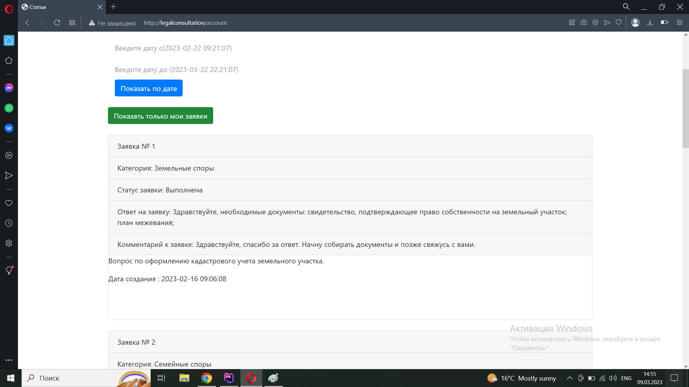
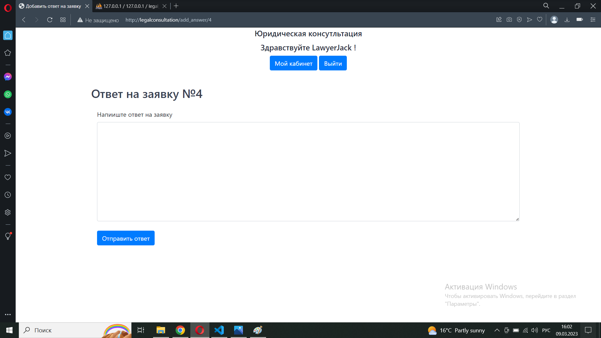

# Описание
Тестовое задание на Laravel(PHP). Включает в себя форму авторизации, две роли (Клиент, Юрист) и возможности для клиента добавлять заявки, комменитровать ответ юриста на заявку, и ставить статус для завявки "выполнено".
* У юриста есть возможность отвечать на заявки клиентов. 
* Также есть фильтры(показать только свои заявки для роли 'user' и фильтр по статусу заявки для роли 'lawyer') использующие ajax запросы.
* Регистрация отсутствует, пароли и логины(клиент, юрист) есть в файле CreateUserSeeder.php.
# Авторизация

# Панель для роли "Клиент"

# Можно создать новую заявку указав категорию и написать текст заявки, также можно добавить изображение

# Так рабоатет фильтр по датам заявок

# Так рабоатет фильтр "Показать только мои зявки"

# Панель для роли "Клиент"

# Так можно применить фильтр по заявкам и указать нужную категорию заявок по статусу("новая", "выполена","в работе")

#  Можно дать ответ на заявку

